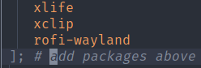

# nix-install
nix-install is a simple command line utility to quickly add packages to your configuration.nix using fuzzy search and rebuild all in one command.

# Dependencies

You must install :
- nix-search
- fzf

You must add the line:

# Features
Fuzzy Search: Easily find and add packages with minimal typing.
Declarative: Integrates directly with configuration.nix, maintaining NixOS's declarative nature.
One Command: Add packages and rebuild your system in one step.

# Installation
Currently, you need to clone the repository and add the script that calls the Rust binary to your PATH.

Add the script to your PATH, e.g., by linking it to /usr/local/bin

# Usage
add the comment line 
"# add packages above"
and nix-install will add packages above

nix-install

< Type in package name into fuzzy search >
# TODO
- [x] Package nix-install as a crate.
- [ ] Add it to Nix Packages.
- [ ] integrate flags for use case like no rebuild and other cases

# Philosophy
While some community members believe this approach might go against the declarative nature of NixOS, nix-install still maintains this principle by modifying configuration.nix. It offers a more convenient way to manage packages without compromising the core values of NixOS.

Open to civil discussion and feedback.
